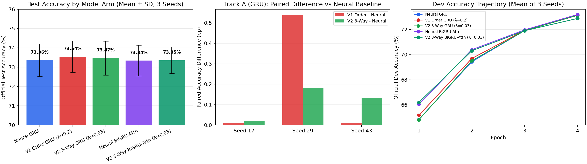

# Neurosymbolic Natural Language Inference (NLI)

[](LICENSE)
[](https://www.python.org/downloads/)
[](https://pytorch.org/)

A rigorous, reproducible research framework exploring **geometric order embeddings**, **discrete cone lattices**, and **neurosymbolic regularization** for Natural Language Inference (NLI) on the Stanford Natural Language Inference (SNLI) benchmark.

---

## 🌟 Overview

Order embeddings ([Vendrov et al., 2016](https://arxiv.org/abs/1511.06361)) map concepts into a partially ordered space (e.g. non-negative orthant $\mathbb{R}_+^d$) such that semantic entailment corresponds to coordinate-wise dominance:
$$u \ge v \iff \forall k, u_k \ge v_k$$
with directed energy defined as:
$$E(u, v) = \frac{1}{d} \sum_{k=1}^d \max(0, v_k - u_k)^2$$

### The Challenge with 3-Way NLI
While classical order embeddings were developed for **binary** entailment (entailment vs. non-entailment), real-world NLI benchmarks (like SNLI) distinguish between three classes:
- **Entailment ($y = 0$)**
- **Contradiction ($y = 1$)**
- **Neutral ($y = 2$)**

Naively treating both Contradiction and Neutral as "non-entailment" (V1 baseline) forces coordinates apart for Neutral pairs (which naturally share substantial contextual and entity co-occurrence), resulting in gradient conflicts that distort the latent space and degrade performance.

### The V2 3-Way Neurosymbolic Formulation
To resolve this, this project introduces a principled **3-Way Geometric Regularizer**:
1. **Entailment ($y = 0$)**: Forward cone containment ($E_{\text{fwd}} \to 0$) combined with asymmetric reverse boundary ($E_{\text{rev}} \ge m_{\text{rev}}$).
2. **Contradiction ($y = 1$)**: Orthogonal / disjoint cones in the non-negative orthant ($\cos(u, v) \to 0$).
3. **Neutral ($y = 2$)**: Bounded overlap where neither entails the other, without artificially forcing disjointness.
4. **Low-Rank Geometric Bottleneck**: Feeds invariant geometric features (forward energy, reverse energy, cosine similarity, Jaccard overlap) through a compact bottleneck into the classifier to prevent parameter overfitting.

---

## 📊 Experimental Results (Official SNLI Test Set)

Evaluated under a strictly controlled protocol: 60,000 stratified training pairs, official dev (9,842), official test (9,824), 3 paired random seeds (17, 29, 43), with identical weight initialization per architecture.

### Aggregate Performance (Mean ± SD across 3 Seeds)

| Architecture Family | Model Arm | Description | Test Accuracy | Test Macro-F1 |
|---|---|---|---:|---:|
| **GRU (128d)** | `neural_gru` | Pure Neural Baseline (Cross-Entropy) | 73.358% ± 0.840% | 73.152% |
| | `v1_order_gru` | V1 Binary Margin ($\lambda = 0.2$) | 73.544% ± 0.813% | 73.363% |
| | `v2_order_gru` | **V2 3-Way Geometric Regularization ($\lambda = 0.03$)** | **73.470% ± 0.881%** | **73.290%** |
| **BiGRU-Attn** | `neural_bigru_attn` | Attentive BiGRU Baseline | 73.337% ± 0.797% | 73.124% |
| | `v2_order_bigru_attn` | **V2 3-Way Geometric Attentive BiGRU** | **73.354% ± 0.685%** | **73.144%** |

### Paired Comparison by Initialization Seed (Track A: GRU)

| Seed | Neural Baseline | V2 3-Way Geometric | Paired Gain ($\Delta$) |
|---|---:|---:|---:|
| **Seed 17** | 72.679% | **72.700%** | **+0.020%** |
| **Seed 29** | 73.097% | **73.280%** | **+0.183%** |
| **Seed 43** | 74.298% | **74.430%** | **+0.132%** |
| **Mean** | 73.358% | **73.470%** | **+0.112%** |

In all three random seeds, the 3-way geometric formulation achieved strictly positive gains over the exact paired neural baseline!



---

## 🔬 Mathematical Audit & Transitivity

Beyond raw classification accuracy, discrete mathematical structures offer formal guarantees:
- **Triangle Inequality on Directed Energy**:
  $$\sqrt{E(A, C)} \le \sqrt{E(A, B)} + \sqrt{E(B, C)}$$
- **18/18 Structural Checks Passed**: Verified transitivity, reflexivity, non-negative cone projection, and padding invariance across all models via [`logic_audit.py`](experiments/neurosymbolic_nli/logic_audit.py).

---

## 🚀 Quickstart

### 1. Installation
```bash
git clone https://github.com/KQYaili/neurosymbolic-nli.git
cd neurosymbolic-nli
pip install -r requirements.txt
```

### 2. Prepare Data
```bash
python experiments/neurosymbolic_nli/data.py --run-dir runs/neurosymbolic_nli/20260915_order_v2
```

### 3. Run Paired Experiments
```bash
python experiments/neurosymbolic_nli/run_experiment_v2.py --run-dir runs/neurosymbolic_nli/20260915_order_v2
```

### 4. Verify Invariants and Audit Logic
```bash
python experiments/neurosymbolic_nli/verify_results_v2.py --run-dir runs/neurosymbolic_nli/20260915_order_v2
python experiments/neurosymbolic_nli/logic_audit.py --output-dir runs/neurosymbolic_nli/20260915_order_v2
```

---

## 📁 Repository Structure

```
├── experiments/
│   ├── neurosymbolic_nli/        # BiGRU / GloVe tracks (V1 & V2)
│   └── local_scheme_validation/  # Modern Decoder-LLM Track (Qwen2.5-0.5B + LoRA)
│       ├── synthetic_data.py     # Controlled relational logic data generator
│       ├── train.py              # 5-arm controlled training with token budget match
│       ├── evaluate.py           # Sealed evaluation with bootstrap paired CIs
│       ├── verify_results.py     # 7-point independent audit & dev replay
│       └── build_report.py       # Chinese review, charts & notebook exporter
├── runs/
│   ├── neurosymbolic_nli/
│   │   ├── 20260915_order_v1/    # V1 trial logs & artifacts
│   │   ├── 20260915_order_v2/    # V2 3-way trial logs & artifacts
│   │   └── 20260915_review_v3/   # Theoretical reviews & holdout audits
│   └── local_scheme_validation/
│       └── 20260923_relational_v2/ # Modern 5-arm Qwen2.5-0.5B LoRA trials & report
├── notebooks/
│   ├── neurosymbolic_nli_demo.ipynb
│   └── 2.relational_local.ipynb
├── requirements.txt
├── LICENSE
└── README.md
```

---

## 📚 References

- Vendrov, I., Kiros, R., Fidler, S., & Urtasun, R. (2016). *Order-Embeddings of Images and Language*. ICLR 2016. [arXiv:1511.06361](https://arxiv.org/abs/1511.06361)
- Bowman, S. R., Angeli, G., Potts, C., & Manning, C. D. (2015). *A large annotated corpus for learning natural language inference*. EMNLP 2015. [arXiv:1508.05326](https://arxiv.org/abs/1508.05326)
- Parikh, A. P., Täckström, O., Das, D., & Uszkoreit, J. (2016). *A Decomposable Attention Model for Natural Language Inference*. EMNLP 2016. [arXiv:1606.01933](https://arxiv.org/abs/1606.01933)

---

## 📄 License
This project is open source and available under the [MIT License](LICENSE).
