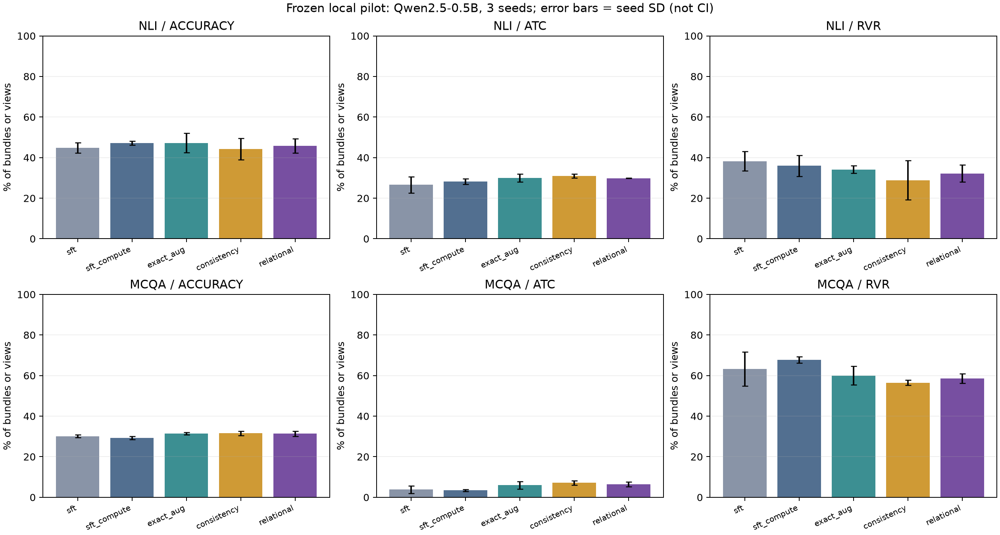

# 本机关系约束后训练：审查、实现与验证

**本轮未通过预先固定的效果门槛，不能向用户确认“该方案确实有效并有提升”。** 完整性复核通过与效果成立是两件事。

已在用户指定的 ChatGPT 网页对话中进行两轮方案讨论并在本机执行；没有使用服务器。网页意见是方案审查，结果来自保留的本地预测文件。

## 固定实验

- 基模：本地 Qwen2.5-0.5B-Instruct，固定 revision `7ae557604adf67be50417f59c2c2f167def9a775`；LoRA q/v，540,672 个可训练参数。
- 5 个训练版本 × 3 个种子（17、29、43），每个 256 步，只保留最后一步；同种子共享初始化与参考抽样序列。没有挑选 seed、checkpoint 或测试后调参。
- 每任务 1,024 个训练源题，仅 102 个已知标签；dev 128、ID-test 256、OOD 2,048 源题。NLI 每题原/反向两个视图；MCQA 每题四种循环选项排列。
- 训练 BF16；评估 FP32 且禁用 TF32。主指标基于 A/B/C(/D) 标签 token 条件概率，并单独报告全词表首 token 的非法率。没有验证自由生成推理过程。
- NLI 是命题逻辑文本，MCQA 是算术选项题。OOD 同时改变复杂度与措辞；不能外推到真实语言因果识别、干预效应或反事实估计。

## 五个对照的含义

| 版本 | 监督/约束 |
|---|---|
| sft | 只用原题已知标签 CE；保留同形批次的零权重计算 |
| sft_compute | 用相同已知标签原题填满整个批次；匹配序列数和有效 token 预算 |
| exact_aug | SFT + 可精确搬运的 MCQA 标签与 NLI 矛盾反向标签 |
| consistency | exact_aug + 无标注 MCQA 语义对齐 JS、NLI 矛盾边缘 JS |
| relational | consistency + 已知非矛盾原题的反向允许集合 {entailment, neutral} |

后四者与基础监督共用同一可用 gold 集合。`sft_compute` 的预算匹配不等于完全相同 FLOPs；按长度选重复原题也会改变曝光频次。全词表 allowed-mass 还包含合法答案质量惩罚，不能把其增量全部解释为新语义能力。

## OOD 结果

数值为三种种子的均值（%）。ATC 表示整组变换都答对；RVR 为关系违反率，越低越好。

| 任务 | 版本 | 全视图准确率 | ATC | RVR | 原始首 token 非法率 |
|---|---|---:|---:|---:|---:|
| nli | base | 47.85 | 29.88 | 0.00 | 93.46 |
| nli | sft | 44.83 | 26.61 | 38.20 | 0.00 |
| nli | sft_compute | 47.20 | 28.17 | 35.95 | 0.12 |
| nli | exact_aug | 47.22 | 29.98 | 34.16 | 0.00 |
| nli | consistency | 44.17 | 30.96 | 28.89 | 0.00 |
| nli | relational | 45.74 | 29.85 | 32.19 | 0.00 |
| mcqa | base | 24.21 | 0.00 | 90.76 | 100.00 |
| mcqa | sft | 30.08 | 3.79 | 63.23 | 0.00 |
| mcqa | sft_compute | 29.26 | 3.45 | 67.80 | 0.00 |
| mcqa | exact_aug | 31.34 | 5.96 | 59.97 | 0.00 |
| mcqa | consistency | 31.56 | 7.13 | 56.51 | 0.00 |
| mcqa | relational | 31.34 | 6.48 | 58.61 | 0.00 |

## 配对差值与冻结门槛

差值单位为百分点，括号内为 2,000 次配对 bundle bootstrap 的 95% 区间。它以三个已训练种子为条件，不代表完整训练随机性；未进行多重检验校正。

| 任务 | 比较 | 准确率差值 [CI] | ATC 差值 [CI] | RVR 差值 [CI] |
|---|---|---:|---:|---:|
| nli | relational_minus_sft | +0.91 [+0.16, +1.64] | +3.24 [+2.41, +4.15] | -6.01 [-7.28, -4.79] |
| nli | relational_minus_sft_compute | -1.46 [-2.45, -0.51] | +1.68 [+0.55, +2.82] | -3.76 [-5.37, -2.13] |
| nli | relational_minus_exact_aug | -1.48 [-2.16, -0.83] | -0.13 [-0.98, +0.73] | -1.97 [-3.03, -0.86] |
| nli | relational_minus_consistency | +1.57 [+0.81, +2.32] | -1.11 [-2.00, -0.23] | +3.30 [+2.18, +4.44] |
| nli | consistency_minus_exact_aug | -3.05 [-3.81, -2.30] | +0.98 [+0.06, +1.89] | -5.27 [-6.36, -4.10] |
| mcqa | relational_minus_sft | +1.26 [+0.68, +1.86] | +2.69 [+2.03, +3.30] | -4.62 [-5.62, -3.64] |
| mcqa | relational_minus_sft_compute | +2.08 [+1.38, +2.78] | +3.03 [+2.31, +3.74] | -9.19 [-10.24, -8.11] |
| mcqa | relational_minus_exact_aug | +0.00 [-0.37, +0.37] | +0.52 [+0.03, +0.99] | -1.36 [-2.09, -0.68] |
| mcqa | relational_minus_consistency | -0.22 [-0.55, +0.11] | -0.65 [-1.07, -0.23] | +2.10 [+1.46, +2.74] |
| mcqa | consistency_minus_exact_aug | +0.22 [-0.17, +0.60] | +1.17 [+0.67, +1.66] | -3.46 [-4.20, -2.76] |

成功要求两个任务分别相对 sft_compute 和 exact_aug 都满足：ATC 区间下界 > 0，准确率下界 > −1pp，RVR 上界 < 0。没有用任务均值掩盖单任务退化。

| 任务 | 对照 | ATC 提升 | 准确率非劣 | RVR 下降 | 总门槛 |
|---|---|---|---|---|---|
| nli | sft_compute | 通过 | 未通过 | 通过 | 未通过 |
| nli | exact_aug | 未通过 | 未通过 | 通过 | 未通过 |
| mcqa | sft_compute | 通过 | 通过 | 通过 | 通过 |
| mcqa | exact_aug | 通过 | 通过 | 通过 | 通过 |

两任务平衡 ATC 均值（描述项）：sft 15.20%；sft_compute 15.81%；exact_aug 17.97%；consistency 19.04%；relational 18.16%。

## 资源、复核与限制

| 版本/种子 | 有效 token | 预算误差 | 训练秒数 | 峰值显存 MiB |
|---|---:|---:|---:|---:|
| sft/17 | 344,615 | 0.0000% | 59.0 | 3202.5 |
| sft_compute/17 | 344,660 | 0.0131% | 56.9 | 3099.8 |
| exact_aug/17 | 344,615 | 0.0000% | 59.1 | 3202.5 |
| consistency/17 | 344,615 | 0.0000% | 56.7 | 3202.5 |
| relational/17 | 344,615 | 0.0000% | 58.7 | 3202.5 |
| sft/29 | 345,016 | 0.0000% | 58.9 | 3204.4 |
| sft_compute/29 | 345,010 | 0.0017% | 56.2 | 3099.6 |
| exact_aug/29 | 345,016 | 0.0000% | 59.6 | 3204.4 |
| consistency/29 | 345,016 | 0.0000% | 59.0 | 3204.4 |
| relational/29 | 345,016 | 0.0000% | 57.4 | 3204.4 |
| sft/43 | 344,751 | 0.0000% | 59.2 | 3204.4 |
| sft_compute/43 | 344,780 | 0.0084% | 57.5 | 3100.4 |
| exact_aug/43 | 344,751 | 0.0000% | 58.6 | 3204.4 |
| consistency/43 | 344,751 | 0.0000% | 59.4 | 3204.4 |
| relational/43 | 344,751 | 0.0000% | 58.8 | 3204.4 |

- 独立重算全部 6,912 源题的真值、语义拆分、102 个标签/任务的输入允许字段；跨 split 语义重合为零。
- 核对 15 个最终 adapter、3,840 条训练日志、数据/代码/协议/模型哈希，并独立重算 96 个预测文件的指标、配对区间与成功门槛。
- 以预定 dev 前四题对 sft_compute/relational 的 seed 17 重载模型并复现 logits；没有通过测试结果挑重放案例。逻辑变换 65,025 组穷举与数值机制检查通过。
- **数据元信息限制**：NLI 源编号区间和 MCQA 编号模 4 可恢复原始标签。训练只编码 prompt，ID 未进入模型输入且未被解析为标签；本轮未发现实际模型泄露。但 public 文件不是强盲化数据，后续必须在新协议下更换为标签无关随机 ID。
- NLI 单一标签预测、MCQA 固定语义错误或均匀分布都可能降低 RVR，所以 RVR 下降不能单独证明正确推理；报告保留标签直方图、熵和原始 logits。
- MCQA JS 为标准等变一致性对照；relational−consistency 才是新增允许集合项的增量。联合 adapter 的跨任务影响不能当作独立 MCQA 新方法。
- 本轮不能证明研究创新、真实自然语言因果推断或服务器规模有效性。若未过门槛，需要新假设、新协议、新 holdout；不能修改本轮测试口径获得“提升”。

## 可复查文件

- `protocol.json`：冻结协议；`implementation.json`、`evaluation_seal.json`：源/模型哈希。
- `training.jsonl`、`console.log`、`evaluation_console.log`：完整执行记录。
- `adapters/`：15 个最终模型；`predictions/`：各视图概率、logits、margin、原始 token、标签、选项映射。
- `summary.json`：逐 seed 指标/区间；`verification.json`：独立完整性验证，保留摘要哈希。
- `INDEPENDENT_REVIEW.md`、`DISCUSSION.md`：本地独立审查与网页版讨论决策。

复现顺序：在项目 WSL 环境运行 `train.py` → `evaluate.py` → `verify_results.py` → `build_report.py`（完整目录下训练/评估先验证后复用最终结果）。
