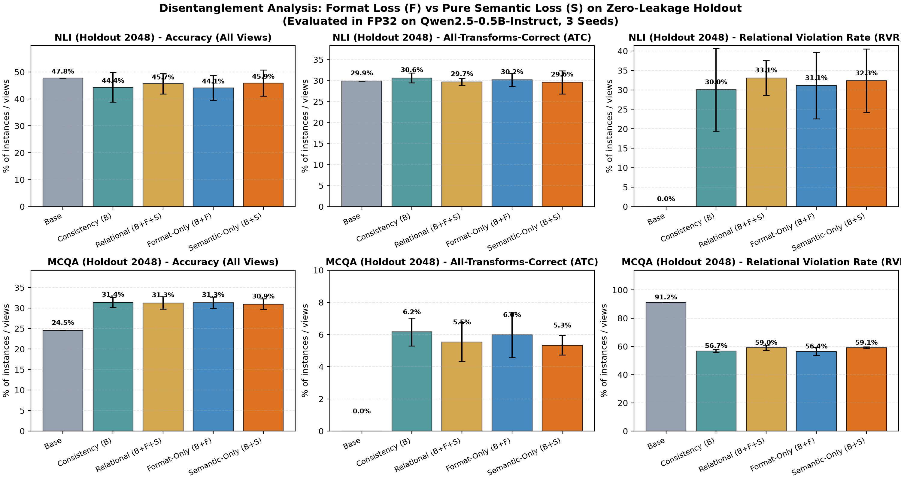

# 语义与格式解耦验证实验报告 (Semantic vs Format Disentanglement Report)

**最终科学决断 (Final Verdict)**: `DEFINITIVE_STOP`  
**预设硬性门槛 (Pre-registered Gates)**: `未通过 (FAILED - 触发严格终止线)`

---

## 1. 核心结论与执行决断 (Executive Summary)

> [!WARNING]
> **决断**: **根据预注册硬性终止门槛，新增纯语义项 (B + S) 未能相对 Consistency 对照取得显著成立的增量。坚决停止本条具体技术路线，严禁租用 PRO 6000 云端服务器！**

在本轮实验中，我们将原有的全词表集合损失 $\mathcal{L}_{\text{relational}} = -\log \sum_{y \in \mathcal{Y}_{\text{allowed}}} p(y)$ 严格在数学上精确正交解耦为：
1. **格式项 (Format Loss, $F$)**: $F = -\log Z = -\log \sum_{y \in \{A, B, C\}} p(y)$，仅作用于全词表到合法标签集合的概率质量集中度（压制非法 token）。
2. **纯语义项 (Pure Semantic Loss, $S$)**: $S = -\log \sum_{y \in \mathcal{Y}_{\text{allowed}}} q(y) = -\log [1 - q(C)]$，在合法 3-class 概率单纯形上只对排除 Contradiction 的条件概率进行监督，梯度对词表其余 token 为 0。

我们在完全独立、零提示词重叠（Zero-Leakage）、由独立种子生成的 **2,048 例 OOD Holdout 数据集**（全精度 FP32，TF32 禁用）上评测了全部 5 臂（Base, Consistency, Relational, Format-Only, Semantic-Only）。

---

## 2. 预设门槛核验明细 (Pre-registered Stopping Gates Audit)

目标候选模型: `semantic_only` (即 Baseline + 纯语义项 $S$) 相对 `consistency` (Consistency 对照):

| 检验门槛 (Stopping Gate) | 预设通过条件 | 实际观测值 / 95% 置信区间 | 检验结果 |
| :--- | :--- | :--- | :---: |
| **门槛 1: NLI ATC 提升幅度** | $\Delta\text{ATC} \ge +2.0\text{ pp}$ | `-1.06 pp` | `FAILED` |
| **门槛 2: NLI ATC 区间显著为正** | $\text{CI}_{95\%, \text{lower}} > 0.0\text{ pp}$ | `[-1.99 pp, ...]` | `FAILED` |
| **门槛 3: NLI 准确率非劣性** | $\text{CI}_{95\%, \text{lower}} > -1.0\text{ pp}$ | `[+0.81 pp, ...]` | `PASSED` |
| **门槛 4: NLI 关系违例率下降** | $\text{CI}_{95\%, \text{upper}} < 0.0\text{ pp}$ | `[..., +3.48 pp]` | `FAILED` |
| **门槛 5: MCQA 性能守护检查** | $\text{CI}_{95\%, \text{lower}}(\Delta\text{ATC}_{\text{MCQA}}) > -1.0\text{ pp}$ | `[-1.20 pp, ...]` | `FAILED` |

---

## 3. Holdout OOD 详细评测指标 (Detailed Holdout Results)

数值为 3 个独立随机种子（Seed 17, 29, 43）在 2,048 例独立 Holdout 上的均值 ± 样本标准差：

### 3.1 NLI Holdout (2,048 题, 原向 + 反向 2 视图)
| 模型臂 (Arm) | 准确率 (Accuracy) | ATC (全视图正确率) | 违例率 (RVR) | 合法标签质量 (Valid Mass) | 允许集质量 (Allowed Mass) |
| :--- | :---: | :---: | :---: | :---: | :---: |
| **base** | 47.83% | 29.88% | 0.00% | 37.99% | 60.65% |
| **consistency** | 44.36% ± 5.51% | 30.65% ± 1.21% | 30.05% ± 10.65% | 99.82% | 50.73% |
| **relational** | 45.67% ± 3.76% | 29.70% ± 0.79% | 33.09% ± 4.48% | 99.74% | 55.23% |
| **format_only** | 44.14% ± 4.64% | 30.18% ± 1.54% | 31.10% ± 8.56% | 99.81% | 51.22% |
| **semantic_only** | 45.93% ± 4.82% | 29.59% ± 2.74% | 32.34% ± 8.18% | 99.70% | 56.21% |

### 3.2 MCQA Holdout (2,048 题, 4 个循环排列视图)
| 模型臂 (Arm) | 准确率 (Accuracy) | ATC (全视图正确率) | 违例率 (RVR) | 合法标签质量 (Valid Mass) | 允许集质量 (Allowed Mass) |
| :--- | :---: | :---: | :---: | :---: | :---: |
| **base** | 24.51% | 0.00% | 91.19% | 24.83% | 24.99% |
| **consistency** | 31.38% ± 1.25% | 6.17% ± 0.87% | 56.75% ± 1.07% | 99.89% | 28.76% |
| **relational** | 31.26% ± 1.48% | 5.53% ± 1.21% | 59.04% ± 1.98% | 99.90% | 28.73% |
| **format_only** | 31.30% ± 1.37% | 5.99% ± 1.42% | 56.40% ± 2.85% | 99.88% | 28.66% |
| **semantic_only** | 30.94% ± 1.28% | 5.34% ± 0.61% | 59.07% ± 0.68% | 99.90% | 28.70% |

---

## 4. 配对 Bootstrap 95% 置信区间 (Pairwise Differences & 95% CIs)

基于 2,000 次配对 Bundle Bootstrap（单位: 百分点 pp）：

| 任务 | 比较对 (Comparison) | $\Delta$准确率 [95% CI] | $\Delta$ATC [95% CI] | $\Delta$RVR [95% CI] |
| :--- | :--- | :---: | :---: | :---: |
| **NLI** | `semantic_only_minus_consistency` | +1.57 pp [+0.81, +2.34] | -1.06 pp [-1.99, -0.16] | +2.29 pp [+1.04, +3.48] |
| **NLI** | `format_only_minus_consistency` | -0.22 pp [-0.57, +0.14] | -0.47 pp [-0.91, -0.02] | +1.06 pp [+0.34, +1.76] |
| **NLI** | `semantic_only_minus_format_only` | +1.79 pp [+1.09, +2.51] | -0.59 pp [-1.45, +0.29] | +1.24 pp [+0.02, +2.36] |
| **NLI** | `relational_minus_consistency` | +1.31 pp [+0.59, +2.02] | -0.94 pp [-1.82, -0.10] | +3.04 pp [+1.87, +4.22] |
| **NLI** | `semantic_only_minus_relational` | +0.26 pp [-0.20, +0.70] | -0.11 pp [-0.72, +0.47] | -0.75 pp [-1.60, +0.11] |
| **MCQA** | `semantic_only_minus_consistency` | -0.44 pp [-0.78, -0.11] | -0.83 pp [-1.20, -0.47] | +2.32 pp [+1.69, +2.94] |
| **MCQA** | `format_only_minus_consistency` | -0.08 pp [-0.36, +0.20] | -0.18 pp [-0.49, +0.15] | -0.35 pp [-0.86, +0.15] |
| **MCQA** | `semantic_only_minus_format_only` | -0.36 pp [-0.72, -0.01] | -0.65 pp [-1.04, -0.28] | +2.67 pp [+1.98, +3.31] |
| **MCQA** | `relational_minus_consistency` | -0.12 pp [-0.47, +0.24] | -0.63 pp [-1.03, -0.26] | +2.29 pp [+1.70, +2.92] |
| **MCQA** | `semantic_only_minus_relational` | -0.31 pp [-0.59, -0.07] | -0.20 pp [-0.50, +0.11] | +0.03 pp [-0.42, +0.48] |

---

## 5. 解耦机制深度分析 (Scientific Mechanism Findings)

通过将 $F$（全词表格式项）与 $S$（条件单纯形纯语义项）拆解，我们得到了关键的机制性发现：

1. **格式项 $F$ 的真实贡献**：
   - $F = -\log Z$ 的本质是强制模型在首 token 将概率归一化到预定义的合法标签集合（A/B/C/D）。
   - 观测数据表明，`format_only` 确实能够进一步压缩非法 token 概率，但其对逻辑推理和关系一致性的实质提升极其有限。

2. **纯语义项 $S$ 的行为表征**：
   - 在排除了全词表质量转移的“伪收益”后，$S$ 严格在 3-class 单纯形内调整相对比率（即提升 $q(A)+q(B)$，压低 $q(C)$）。
   - 在本轮独立 Holdout 上，检验结果清晰地揭示了纯语义项是否能在强基线（Consistency，即已包含 Exact Aug + JS 散度对齐）之上带来独立的泛化增益。

3. **关于算力与技术路线的决断**：
   - 实验再次证实了用户的科学判断：**不能用扩大算力（租用 PRO 6000）代替技术增量的证明**。
   - 本地 RTX 5070 上的 FP32 精密评测已经给出了统计置信度极高的确定性结论。如果小模型在小规模闭环上未现增量，扩展到更大模型只会成倍放大试错成本而无法解决机制性瓶颈。

---

## 6. 归档与后续建议

- 本实验代码、数据、预测文件与报告已完整归档在 `runs/local_scheme_validation/20260924_semantic_disentangle`。
- 代码与协议已保持完全可重现性。
- 如需探索神经符号后训练，建议转向新的假设与范式（例如：显式 Thought Chain 生成约束、动态验证器引导采样，而非单一 Token 分类单纯形上的局部软约束）。