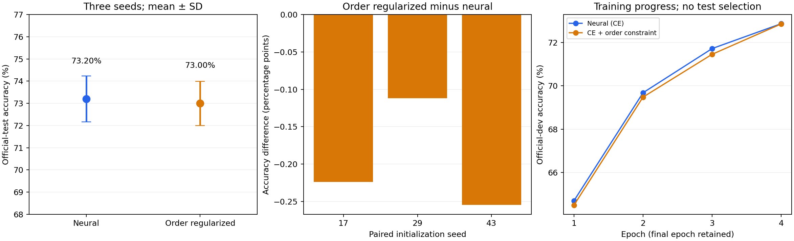

# 从四句序嵌入演示到可复现的自然语言蕴涵实验

本轮偏序正则的平均测试准确率为 73.001%，神经对照为 73.198%，差值 -0.197 个百分点。三个种子均下降，因此本轮不支持“偏序正则提高 SNLI 准确率”的结论。

本项目沿用 `2.ipynb` 末尾的 GRU＋序嵌入路线。任务是 SNLI 三分类（蕴涵、矛盾、中立），不估计干预因果效应。默认推理使用当前较好的神经对照；偏序模型保留为结构研究与消融对照。

## 实际改动

- 用有效长度与 packed GRU 排除 padding；同一句右侧增加 padding 后输出不变。
- 用 Softplus 正值投影替代演示中的 ReLU，增加三分类头，保留中立与矛盾的区别。
- 两组具有相同模型结构、初始化、参数量、数据次序与训练步数。唯一实验变量是偏序辅助损失权重：0 对 0.2。
- 偏序损失只约束真实蕴涵边与非蕴涵边，不把所有反向边自动当负例。
- 增加离散图闭包、路径见证和 SCC 等价类；它们验证给定边上的结构，不证明神经预测边是真实语义。
- 原四句演示改为局部函数，避免覆盖 SNLI 的全局 `vocab`，并修正“零样本”“反对称律”的过度表述。
- 补齐当前笔记本依赖，修复多输入训练计数和模型设备引用，保留 IMDb 本地解压缓存。

## 固定协议

官方 train 分层抽取 60,000 条（每类 20,000）；官方 dev 全部 9,842 条；官方 test 全部 9,824 条。词表仅来自抽样训练集，共 12,187 个词元，GloVe 100 维；句对在三个划分间无重复。种子 17、29、43，每组 4 轮，batch 256，Adam 0.001，梯度范数上限 1，FP32 禁用 TF32。所有训练结束后才对最终 checkpoint 进行测试；不根据测试结果选择 epoch 或调整本轮参数。

## 结果

| 方法 | 种子 | 测试准确率 | 测试 Macro-F1 |
|---|---:|---:|---:|
| neural | 17 | 72.445% | 72.117% |
| order_regularized | 17 | 72.221% | 71.864% |
| neural | 29 | 72.771% | 72.483% |
| order_regularized | 29 | 72.659% | 72.371% |
| neural | 43 | 74.379% | 74.312% |
| order_regularized | 43 | 74.125% | 74.060% |

神经对照平均 Macro-F1：72.971%；偏序正则：72.765%。逐测试样本配对 bootstrap 的差值 95% 区间为 [-0.373, -0.017] 个百分点；该区间以本次三个已训练种子对为条件，不代表完整的随机种子不确定性。



## 数学核查与结论边界

精确的坐标支配关系满足反身性、向量反对称性和传递性；非零能量阈值不保证传递。反例 A=0、B=0.2、C=0.4 时，两条相邻边能量均 0.04<0.05，远端边能量为 0.16。近似关系满足有向三角界 `sqrt(E(A,C)) <= sqrt(E(A,B)) + sqrt(E(B,C))`。

自然语言中的语义等价句允许双向蕴涵；先按等价关系取商，才讨论句子语义的偏序。狗跑步与狗吠叫可以同时发生，演示中的动作不匹配只能作为非蕴涵例子。四句中只留出 A→C 关系，不能称为未见句子的零样本验证。

结构审计 18/18 通过；逐样本指标、配对初始化、最终训练步数、数据/代码哈希和训练后 padding 不变性核查见 `verification.json`。数学验证与自然语言预测准确率分别报告，不能互相替代。

针对性诊断还暴露了具体失败：固定 seed17 神经模型把 “A man is sleeping.” → “A man is awake.” 和 “A person is standing.” → “A person is wearing a hat.” 都预测为蕴涵。按同一主体、同一时刻的通常语义，前者应为矛盾、后者为中立。因此该模型仍会依赖词面重叠；这些失败被保留在笔记本中，没有用手工覆盖预测掩盖。三个探针仅是诊断样例，不是新的统计基准。

## 复现与文件

在项目根目录、WSL Python 环境运行：

```bash
python experiments/neurosymbolic_nli/data.py --run-dir runs/neurosymbolic_nli/20260915_order_v1
python experiments/neurosymbolic_nli/run_experiment.py --run-dir runs/neurosymbolic_nli/20260915_order_v1
python experiments/neurosymbolic_nli/verify_results.py --run-dir runs/neurosymbolic_nli/20260915_order_v1
```

已有最终 checkpoint 时复现入口复用它们，不重新训练。`protocol.json`、`implementation.json`、`split_manifest.json` 固定协议与来源；`training.jsonl`/`console.log` 保留训练过程；`checkpoints/` 保留六份最终参数；`*_test_predictions.npz` 保留六组逐样本概率和预测；`summary.json` 与 `verification.json` 保留汇总和核查。

下一步如探索更强语义模型或约束形式，应重新登记实验并仅使用开发集选择方案；本次负结果不能用继续试探测试集掩盖。

## 主要依据

- [Order-Embeddings of Images and Language](https://arxiv.org/abs/1511.06361)：原序嵌入研究的 SNLI 实验把矛盾和中立合并为非蕴涵，不能直接与本项目三分类准确率对比。
- [SNLI 官方数据说明](https://nlp.stanford.edu/projects/snli/)：官方 train/dev/test 划分与三分类标注。
